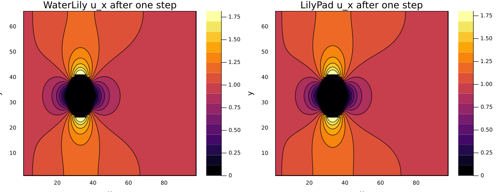
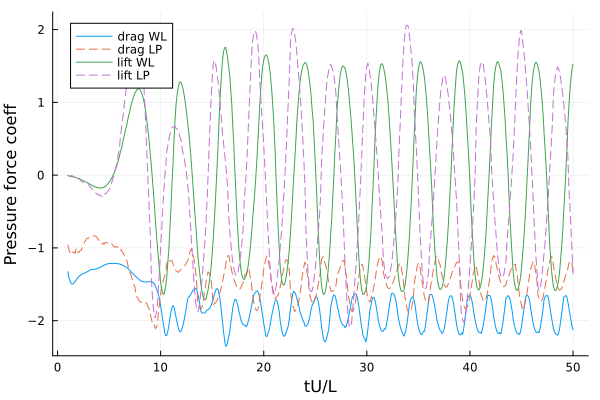
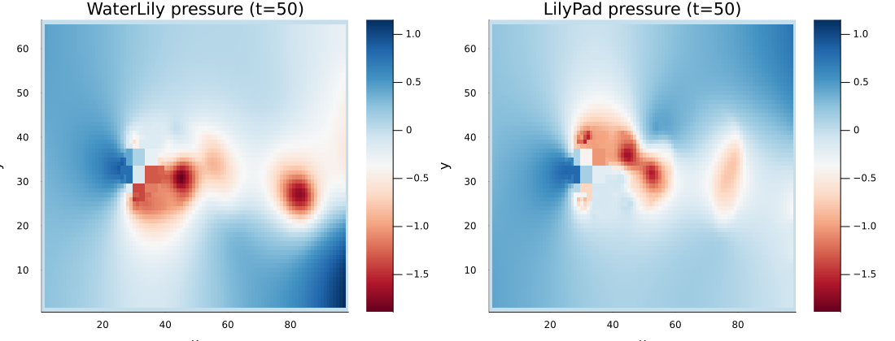

# LilyPad.jl

LilyPad.jl is a semi-Lagrangian momentum-step variant of WaterLily.jl.

The API is intentionally the same at the simulation level, so users can switch
the method by changing the constructor only.

## Method Difference

- WaterLily: uses `Simulation(...)` (flux-form convective step)
- LilyPad: uses `LilyPadSim(...)` (semi-Lagrangian predictor/corrector, fixed timestep)

Everything else (`sim_step!`, `sim_time`, field access, measurement utilities)
stays the same.

## Example: Flow Over a Circle (Same as WaterLily README)

This is the same circle setup from WaterLily's README so we can compare directly.

```julia
using LilyPad
using Plots

function circle_lp(n, m; U=1)
    radius, center = m/8, m/2 - 1
    sdf(x, t) = sqrt(sum(abs2, x .- center)) - radius

    LilyPadSim((n, m),   # domain size
               (U, 0),   # domain velocity (& velocity scale)
               2radius;  # length scale
               ν=0,body=AutoBody(sdf))
end

lp = circle_lp(3 * 2^5, 2^6)
sim_step!(lp, 10) # for example
```
The only difference is using the `LilyPadSim` constructor instead of `WaterLily.Simulation`.

### Comparison to WaterLily Results

The semi-Lagrangian method enables extremely large time steps without loss of stability, but this naturally changes details of the simulated solution. You can reproduce the README circle comparison locally by running:

```sh
julia --project=. examples/readme_circle_compare.jl
```

One-step velocity comparison (`u_x`):



Long-run force histories (`tU/L = 50`):



Final pressure field comparison (`tU/L = 50`):



These are the current outputs from `examples/readme_circle_compare.jl` for the
inviscid circle case (`ν=0` in both WL and LP, `fixed_dt=1.5` for LP).
Metrics are computed over the settled regime `t=25–50`. Lift mean is reported
as an absolute difference (WL - LP), not a relative error, because the expected
mean lift is near zero.

- `lift_mean_abs_err = -0.1031`
- `drag_mean_err = 0.2472`  (LP predicts ~25% lower mean drag than WL)
- `drag_std_err  = -0.0378` (~3.8% larger drag oscillation amplitude)
- `lift_std_err  = -0.0170` (~1.7% larger lift oscillation amplitude)

Current circle example uses an inviscid-to-inviscid comparison (`ν=0` in both
simulations) and a constant timestep (`Δt=1.5`) for LilyPad.

## Quick Switching Pattern

If you already have a WaterLily setup function, make the constructor injectable:

```julia
using WaterLily
using LilyPad

function circle(make_sim, n, m; Re=100, U=1)
    radius, center = m/8, m/2 - 1
    sdf(x, t) = sqrt(sum(abs2, x .- center)) - radius
    make_sim((n, m), (U, 0), 2radius; ν=U * 2radius / Re, body=AutoBody(sdf))
end

wl = circle(Simulation, 96, 64)
lp = circle(LilyPadSim, 96, 64)
```

## Current Scope

This package is still under development.

- Validated in 2D and 3D on SIMD, CPU, and GPU.
- No explicit viscous damping has been added yet.
- The time-stepping defaults at `Δt = 1.5`, but an adaptive scheme that takes advantage of SL-integration stability would be better.

For method details and development notes, see `CLAUDE.md`.
